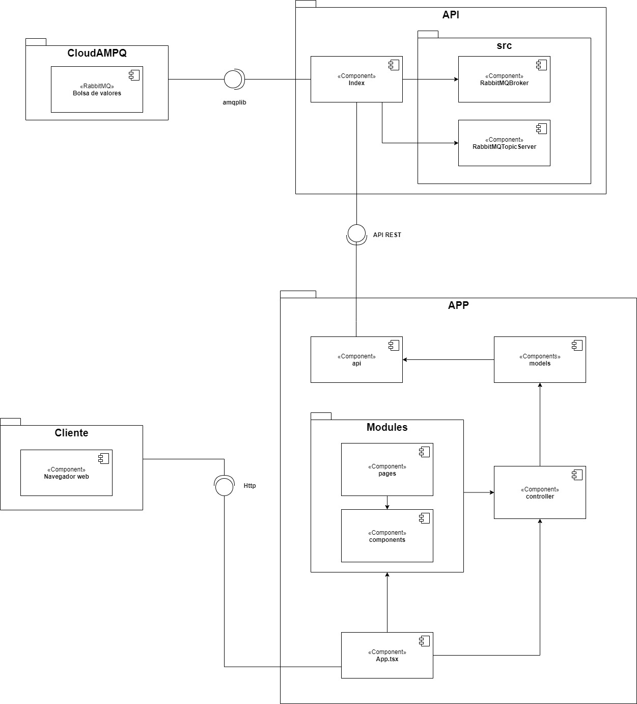
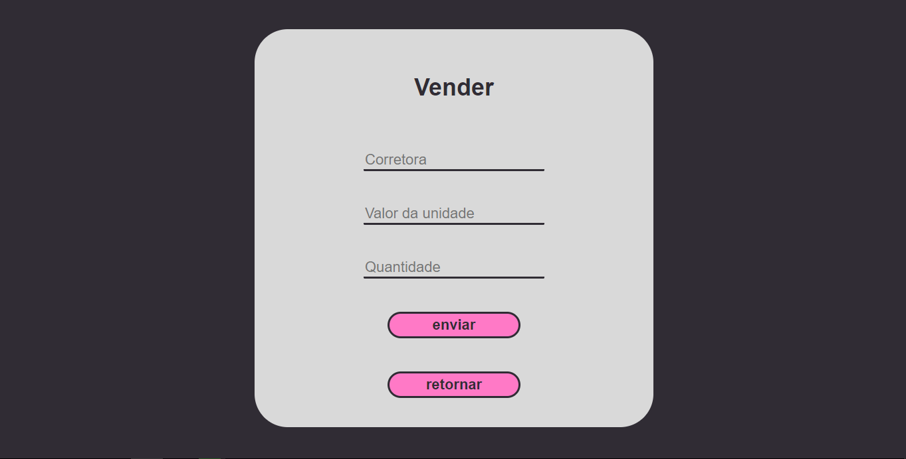

# bovespa-rabbitmq

* [Matheus Felipe Ferreira Martins](https://github.com/MatheusFFM), matheus.martins.1215641@sga.pucminas.br
* [Thiago Jorge Queiroz Silva](https://github.com/ThiagoQueirozSilva), thiago.queiroz@sga.pucminas.br

---

_Curso de Engenharia de Software, Unidade Praça da Liberdade_

_Instituto de Informática e Ciências Exatas – Pontifícia Universidade de Minas Gerais (PUC MINAS), Belo Horizonte – MG – Brasil_

---

_**Resumo**. Middlewares orientados a mensagens (MOM – Message Oriented Middlewares) são sistemas que permitem o envio de mensagens entre entidades de um sistema distribuído, esse trabalho utiliza dessa comunicação indireta por meio da tecnologia do RabbitMQ para desenvolver um sistema que simule uma bolsa de valores._

---
**1. Introdução**

O codigo em questão se trata de uma aplicação que foi desenvolvida para simular um sistema de bolsa de valores. Onde Clientes possam anunciar compras e vendas de ações e distribuir assim essas operações para os clientes interessados exibindo também caso alguma transição aconteça. Essa dispersão de operações entre os clientes foi feita utilizando o sistema de topics publish-subscribe do middleware RabbitMQ.

**2. Projeto da Solução**

    1.1. Requisitos funcionais

| No.           | Descrição                       | Prioridade |
| ------------- |:-------------------------------:| ----------:|
| RF1       | O usuário poderá escolher os tópicos de interesse para ouvir | Alta      |
| RF2    |   O usuário poderá cadastrar ações de compra                              |  Alta     |
| RF3 |     O usuário poderá cadastrar ações de venda                            |  Alta  | 
| RF4 |     O usuário deverá receber as mensagens de transição realizadas                           |  Alta  | 
| RF5 |     O usuário deverá receber as compras e vendas cadastradas                           |  Média  | 
| RF6 |     O sistema deve atualizar uma compra ou venda caso ocorra uma transição                           |  Média  | 

    1.2. Tecnologias

Esse projeto possui uma API que utiliza a linguagem typescript, realizando uma conexão com o sistema de fila de mensagem e a amarração ao _topic exchange_ que segue a seguinte lógica:


Esse é o exemplo oficial, retirado do [tutorial do RabbitMQ de _topic exchange_](https://www.rabbitmq.com/tutorials/tutorial-five-python.html), basicamente, utilizando esse modelo teremos um _topic exchange_ que realiza um roteamento de mensagens de acordo com seu tópico, por exemplo, na imagem acima, o cliente 1 (C1) conectado a fila 1 (Q1) irá receber todas mensagens com o tópico _orange_, já o cliente 2 (C2) conectado a fila 2 (Q2), tem interesse em ouvir mensagens sobre _rabbit_ e _lazy_.

Isso permite a seleção de tópicos que o cliente deseja ouvir, fazendo com que sua conexão é configurada para receber apenas mensagens enviadas com esse tópico. A API é fornecida por meio do Express.js, um framework para o Node.js para a construção de aplicações web e  APIs.

O serviço de RabbitMQ está hospedado no CloudAMPQ uma aplicação de RabbitMQ _as a service_, que permite a monitoração e configuração de componentes do RabbitMQ.

A interface com o usuário utiliza da linguagem typescript e das bibliotecas ReactJS e StyledComponents para a produção e estilização de componentes, juntamente com o framework NextJS para auxiliar no sistema de roteamento e o Axios, um cliente baseado em promessas HTTP para realizar a conexão com a REST API desenvolvida.

**3. Execução**

### Inicialização

```bash
# Clonar o repositório
$ git clone https://github.com/PUC-DISCIPLINAS/bovespa-rabbitmq-matheus-e-thiago.git

# Entrar na pasta do projeto clonado
$ cd bovespa-rabbitmq-matheus-e-thiago
```

### Execução - API

```bash
# Entrar na pasta do projeto da API
$ cd api

# Instalar dependências
$ yarn

# Inicializar o servidor
$ yarn start
```

Retorna que o servidor está pronto e aberto na porta 8002.

### Execução - Interface

É necessário que o servidor esteja em execução para o cliente funcionar corretamente.

```bash
# Entrar na pasta do projeto com a interface
$ cd app

# Instalar dependências
$ npm install

# Inicializar o servidor
$ npm run dev
```

Caso retorne que a aplicação foi compilada com sucesso, ela será disponibilizada na porta 3000. Entre no navegador e digite localhost:3000 para ver a aplicação.

**Observação:** O sistema não possui banco de dados, logo a persistência é realizada em memória, casa o servidor seja reiniciado os dados serão perdidos, logo, recomenda-se também a deletar o conteúdo do localstorage da porta 3000.

	
**4. Modelagem de dados**

    3.1. Diagrama de Componentes



    3.2. Diagrama de Classes

  

**5. Sistema desenvolvido**

Uma vez que o servidor e em seguida, a interface é inicializada e o usuário acessar o localhost:3000, a aplicação vai procurar no localStorage do usuário, se existe o item **id**, responsável por selecionar a conexão desse usuário, caso ela ainda não tenha sido estabelecida, o sistema redireciona o usuário para uma página de _bind_.


Nessa página há algumas possibilidades de interesses pro usuário escolher, uma vez que ele selecione seus interesses e se inscreve neles, uma nova conexão será realizada pela API, a aplicação salvará o id para reconhecer esse usuário e ele só receberá novas operações que tenham como assunto os interesses que ele selecionou. Em seguida o sistema renderizará a home.


Aqui foram selecionados os dois primeiros interesses.


Essa é a página home, que apresenta as opções de cadastrar uma nova compra ou uma nova venda, também mostra a lista de operações dos tópicos selecionados, por enquanto está vazia, então ao clicar em comprar, abrirá um formulário para cadastrar uma operação de compra e ela será inserida também na lista da home.


**Atenção:** a corretora a ser interesse de compra deve ser uma daquelas selecionadas na hora de escolher interesses para aparecer na home.


Agora, ao inserir uma nova operação de venda que atenda aos critérios da compra já cadastrada, será realizado um match e reconhecida uma transação.




Como serão inseridas 10 unidades, e o desejo de compra é de apenas 5, sobrarão 5 delas e será realizada uma transferência das outras 5.


Repare que a página foi atualizada com os novos dados, e a quantidade das operações de compra e venda foram alteradas. Caso outro usuário cadastre uma nova operação com o mesmo tópico, o botão de atualizar da home poderá ser utilizado para recolher essa inserção.

Caso uma nova operação com um interesse fora dos selecionados no início seja escolhida, ela não será inserida na lista.


Agora, ao inserir essa venda relacionada ao VALE5, ela não aparece na página inicial.


Porém, essa operação de venda relacionada a PETR4 pertence aos interesses, logo, ela será inserida na página inicial.


Como esperado, apenas aquela que corresponde ao interesse foi inserida na lista, caso outro usuário tivesse a VALE5 entre os interesses, sua conexão iria ouvir aquela inserção e colocá-lo na lista.


Por fim, o terminal do servidor também registra todas as operações que foram consumidas e qual o id da conexão que a consumiu.

**6 Conclusão**

Com a conclusão deste projeto foi possível aprender melhor o funcionamento do middleware de mensageria RabbitMQ e notar sua praticidade. Foi possível explorarar o funcionamento da tecnologia e notou-se que ela é uma solução muito eficiente quando se necessita de um sistema de mensageria com comunicação indireta. Além disso foi possível também incrementar conhecimentos a respeito de outras tecnologias que foram utilizadas no trabalho como o express.js e axios. 
